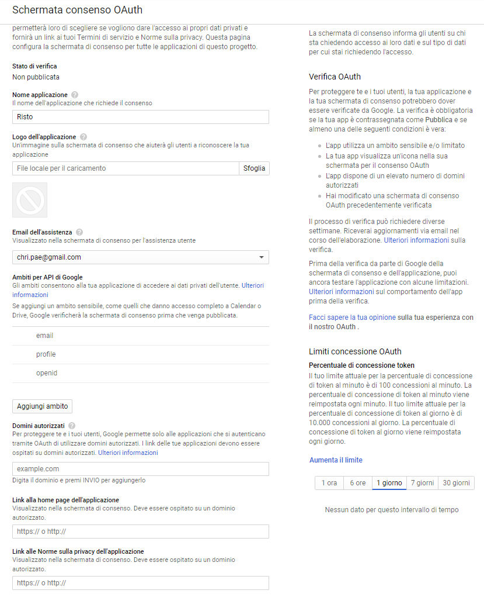

# Authetication

## Google case

### Requirements

Configure a project in Google Console API:

- Input your host domain name
- Configure permissions page for external users (all Google users)
- Ask for your application to be reviewed and accepted (3-4 weeks)
- Obtain CLIENT_ID and CLIENT_SECRET

### Flow

This is the flow client-side:

- "Sign-In with Google" button click
- "Permission" page
- `onSuccess(gUser) { token = gUser.getAuthResponse.id_token; sendToServer(token); }`

This is the flow server-side:

- `verify(token);`
- `payload = token.payload;`
- `registerUser(payload);`

### Refresh code

For accessing user data while user is offline, the [following flow has to be followed](https://developers.google.com/identity/sign-in/web/server-side-flow).

Refresh code obtained has to be stored on the backend.

### Asking additional permissions

[Here](https://developers.google.com/identity/sign-in/web/incremental-auth). In case we want to support incremental permissions. Example asking for G. Drive backups or similar.

